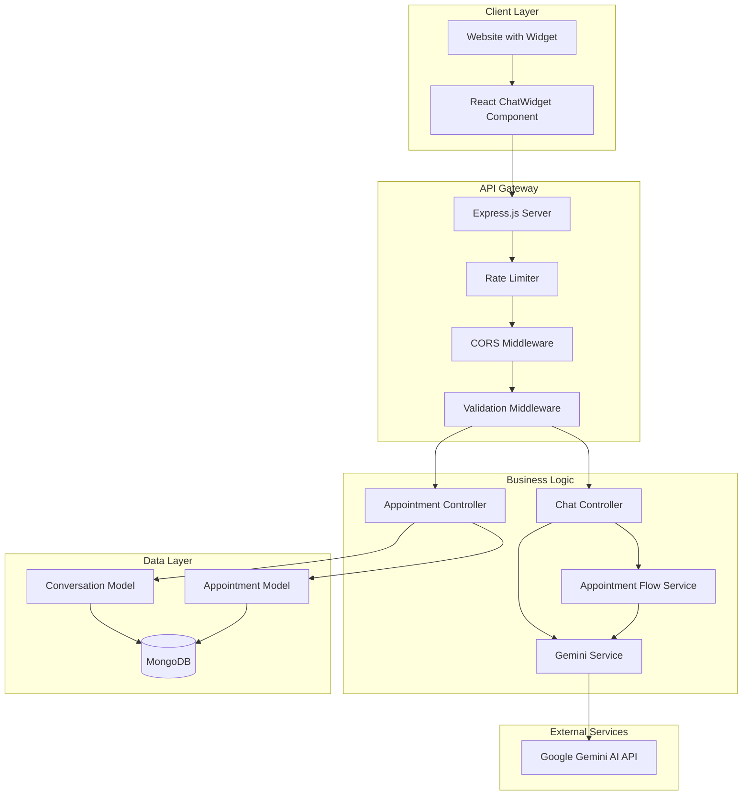
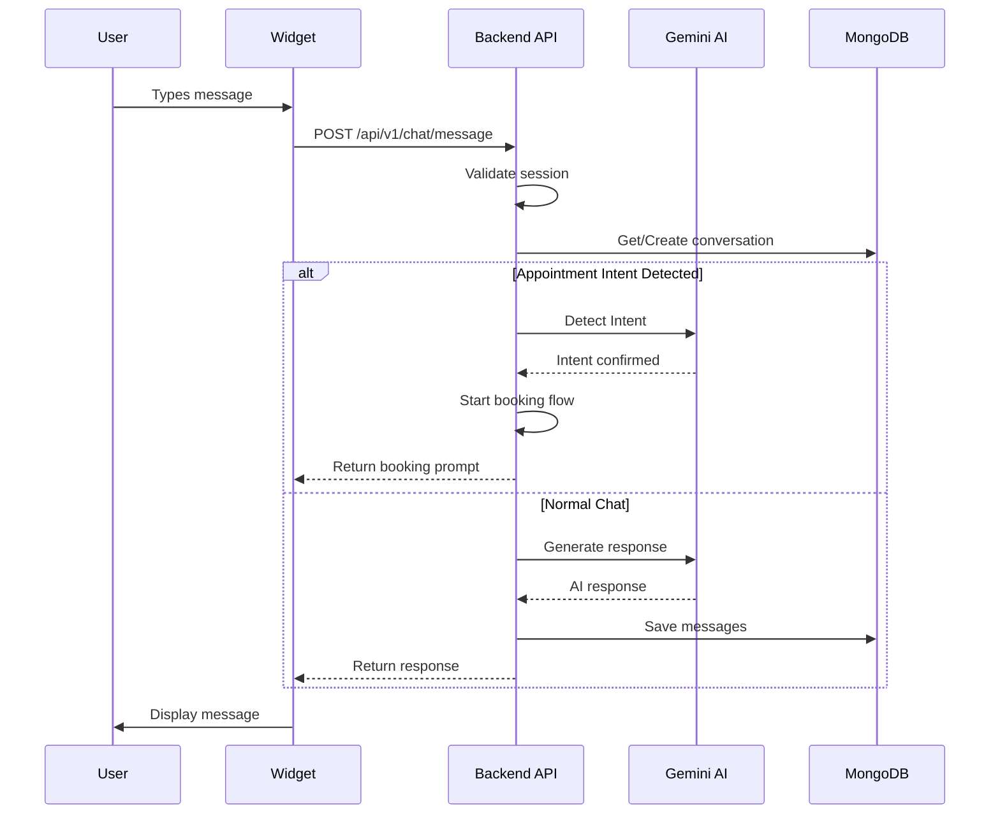
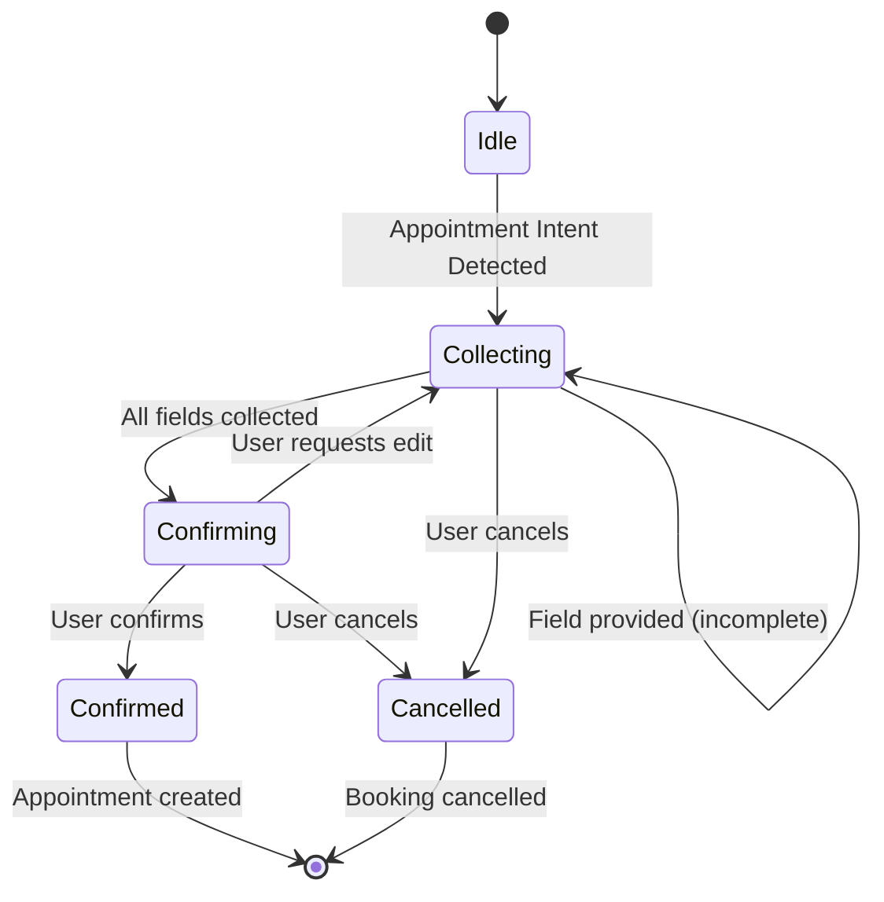
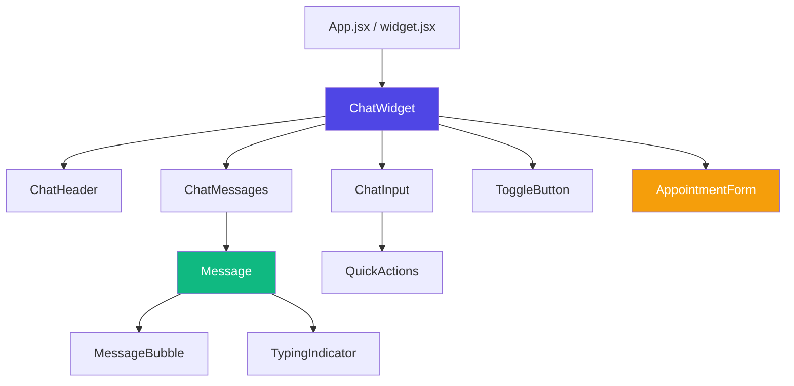
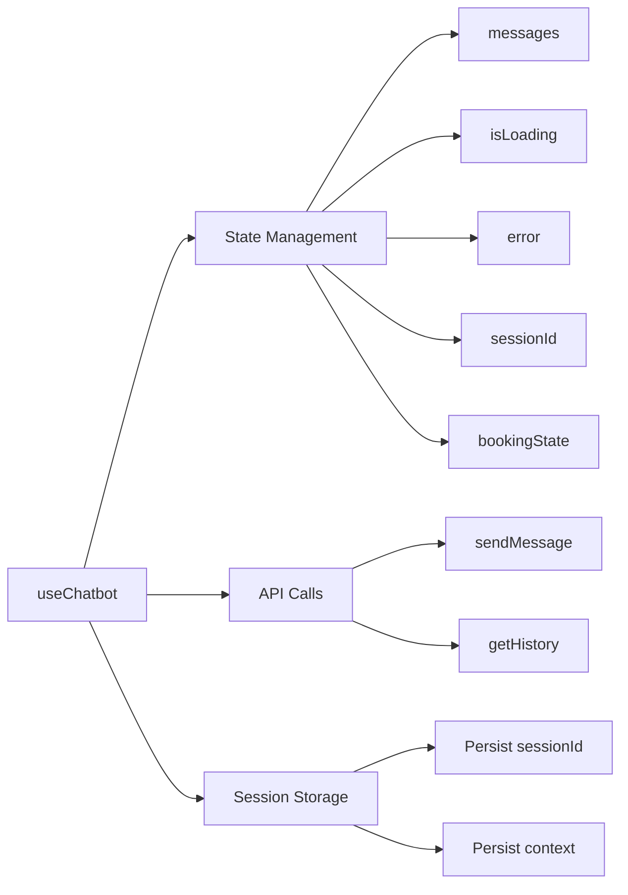
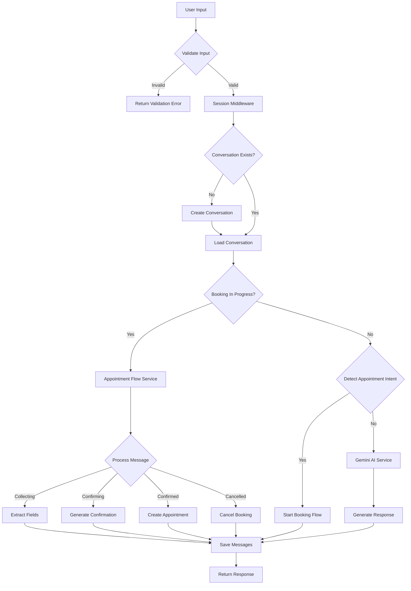
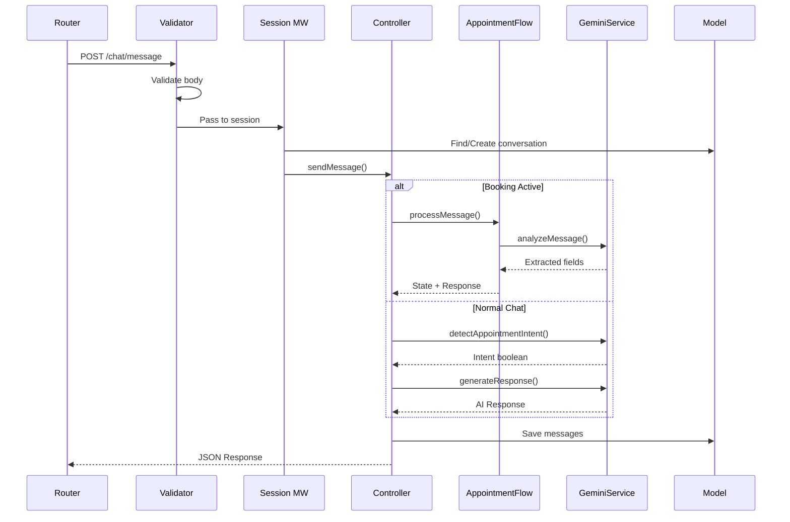
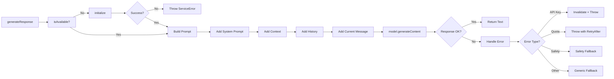
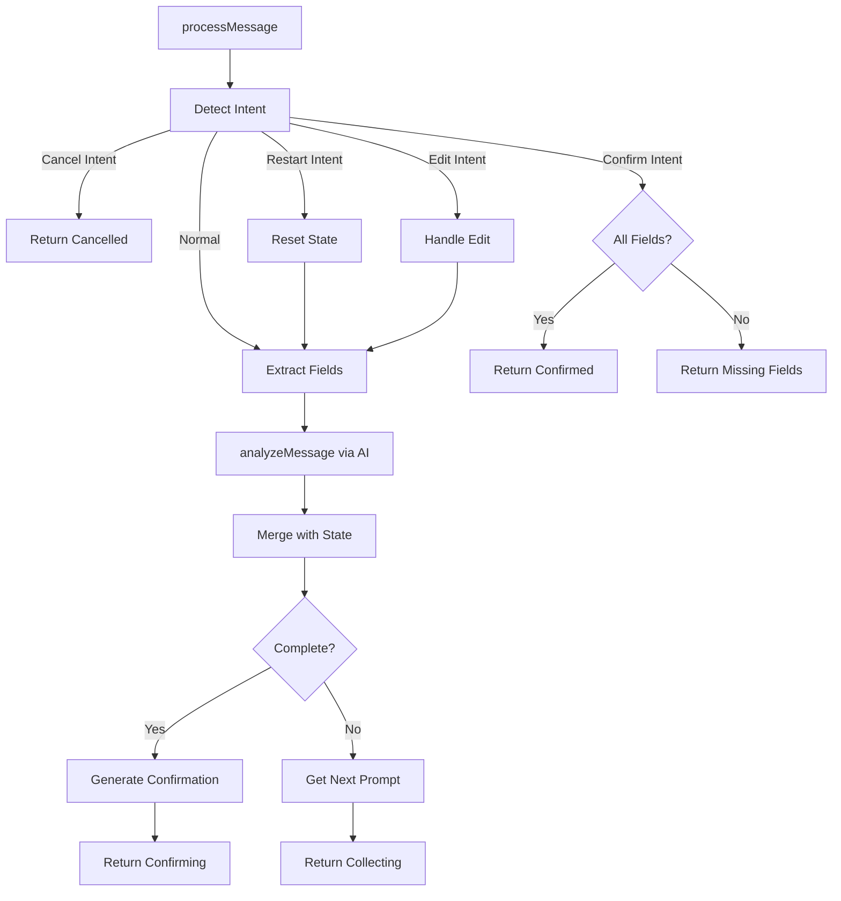

# Veterinary Chatbot SDK

A production ready, full stack veterinary chatbot solution featuring an AI powered conversational interface with intelligent appointment booking capabilities. Built with Node.js/Express backend and React frontend powered by Google Gemini AI.

---

## Table of Contents

1. [Overview](#overview)
2. [Features](#features)
3. [Technology Stack](#technology-stack)
4. [Architecture Overview](#architecture-overview)
5. [System Design](#system-design)
6. [Project Structure](#project-structure)
7. [Setup Instructions](#setup-instructions)
8. [Environment Variables](#environment-variables)
9. [API Reference](#api-reference)
10. [Component Architecture](#component-architecture)
11. [Data Flow](#data-flow)
12. [Function Calling Flow](#function-calling-flow)
13. [Key Decisions and Trade-offs](#key-decisions-and-trade-offs)
14. [Assumptions](#assumptions)
15. [Future Improvements](#future-improvements)
16. [Testing](#testing)

---

## Overview

The Veterinary Chatbot SDK provides a complete solution for veterinary clinics to integrate an AI powered chatbot into their websites. The system handles pet health inquiries, provides veterinary guidance and manages appointment bookings through natural conversation.

### Core Capabilities

- **AI Powered Responses**: Leverages Google Gemini AI for intelligent, context aware veterinary assistance
- **Conversational Appointment Booking**: Multi step appointment scheduling through natural dialogue
- **Embeddable Widget**: Single script deployment for any website
- **Persistent Sessions**: MongoDB backed conversation history and appointment management
- **Veterinary Focus**: Trained system prompt ensures responses stay within veterinary scope

---

## Features

| Feature | Description |
|---------|-------------|
| AI Chat Interface | Real time chat with Google Gemini AI for pet health questions |
| Appointment Booking | Intelligent conversational flow for scheduling appointments |
| Session Management | Persistent chat sessions with history retrieval |
| Widget Embedding | Single JavaScript file for easy website integration |
| Input Validation | Comprehensive request validation with detailed error messages |
| Rate Limiting | API protection against abuse |
| CORS Support | Configurable cross origin resource sharing |
| Error Handling | Centralized error handling with proper HTTP status codes |
| Logging | Winston based structured logging |

---

## Technology Stack

### Backend
| Technology | Purpose |
|------------|---------|
| Node.js 18+ | Runtime environment |
| Express.js | Web framework |
| MongoDB / Mongoose | Database and ODM |
| Google Gemini AI | AI response generation |
| express-validator | Request validation |
| Winston | Logging |
| Helmet | Security headers |
| express-rate-limit | Rate limiting |

### Frontend
| Technology | Purpose |
|------------|---------|
| React 18 | UI library |
| Vite | Build tool |
| Axios | HTTP client |
| TailwindCSS | Styling |
| PostCSS | CSS processing |

---

## Architecture Overview



---

## System Design

### High Level Request Flow



### Appointment Booking State Machine



---

## Project Structure

```
veterinaryChatbotSDK/
├── backend/                          # Node.js/Express Backend
│   ├── src/
│   │   ├── app.js                    # Express application setup
│   │   ├── server.js                 # Server entry point
│   │   ├── config/
│   │   │   ├── constants.js          # Application constants
│   │   │   ├── cors.js               # CORS configuration
│   │   │   ├── database.js           # MongoDB connection
│   │   │   └── index.js              # Config exports
│   │   ├── controllers/
│   │   │   ├── chatController.js     # Chat message handling
│   │   │   ├── appointmentController.js  # Appointment CRUD
│   │   │   └── index.js              # Controller exports
│   │   ├── middleware/
│   │   │   ├── errorHandler.js       # Global error handling
│   │   │   ├── requestLogger.js      # Request logging
│   │   │   ├── sessionMiddleware.js  # Session management
│   │   │   ├── validate.js           # Validation wrapper
│   │   │   └── validators.js         # Validation rules
│   │   ├── models/
│   │   │   ├── Appointment.js        # Appointment schema
│   │   │   ├── Conversation.js       # Conversation schema
│   │   │   ├── ChatSession.js        # Session schema
│   │   │   └── index.js              # Model exports
│   │   ├── routes/
│   │   │   ├── v1/
│   │   │   │   ├── appointmentRoutes.js  # Appointment endpoints
│   │   │   │   ├── chatRoutes.js     # Chat endpoints
│   │   │   │   └── index.js          # Route aggregation
│   │   │   └── widgetRoutes.js       # Widget file serving
│   │   ├── services/
│   │   │   ├── geminiService.js      # Gemini AI integration
│   │   │   ├── appointmentFlowService.js  # Booking flow logic
│   │   │   ├── chatService.js        # Chat business logic
│   │   │   └── index.js              # Service exports
│   │   └── utils/
│   │       ├── ApiError.js           # Custom error class
│   │       ├── ApiResponse.js        # Response helpers
│   │       └── logger.js             # Winston logger
│   ├── tests/
│   │   └── test-database.js          # Database tests
│   ├── public/                       # Static demo page
│   ├── logs/                         # Log files
│   ├── package.json
│   └── .env.example
│
├── frontend/                         # React Widget Frontend
│   ├── src/
│   │   ├── App.jsx                   # Demo application
│   │   ├── main.jsx                  # React entry point
│   │   ├── widget.jsx                # Widget entry (IIFE bundle)
│   │   ├── components/
│   │   │   ├── ChatWidget.jsx        # Main chat container
│   │   │   ├── ChatHeader.jsx        # Chat header
│   │   │   ├── ChatInput.jsx         # Message input
│   │   │   ├── ChatMessages.jsx      # Message list
│   │   │   ├── Message.jsx           # Individual message
│   │   │   ├── AppointmentForm.jsx   # Booking form
│   │   │   ├── ToggleButton.jsx      # Open/close button
│   │   │   ├── TypingIndicator.jsx   # Loading animation
│   │   │   └── QuickActions.jsx      # Quick action buttons
│   │   ├── hooks/
│   │   │   ├── useChatbot.js         # Main chatbot hook
│   │   │   ├── useChat.js            # Chat state hook
│   │   │   └── useAppointmentBooking.js  # Booking hook
│   │   ├── services/
│   │   │   └── apiService.js         # API client
│   │   ├── styles/
│   │   │   └── index.css             # Global styles
│   │   └── utils/
│   │       └── helpers.js            # Utility functions
│   ├── dist/
│   │   └── widget/
│   │       ├── chatbot.js            # Built widget bundle
│   │       └── chatbot.css           # Built widget styles
│   ├── vite.config.js
│   ├── package.json
│   └── .env.example
│
├── shared/                           # Shared utilities
│   └── constants.js
├── package.json                      # Root workspace config
└── README.md
```

---

## Setup Instructions

### Prerequisites

- Node.js 18.0.0 or higher
- npm 9.0.0 or higher
- MongoDB (local or Atlas cloud)
- Google Gemini API key

### Step 1: Clone the Repository

```bash
git clone https://github.com/aaryan182/veterinary-chatbot-sdk.git
cd veterinary-chatbot-sdk
```

### Step 2: Install Dependencies

```bash
# Install all workspace dependencies
npm install
```

### Step 3: Configure Environment Variables

Create `.env` files in both backend and frontend directories:

**Backend** (`backend/.env`):
```bash
cp backend/.env.example backend/.env
# Edit backend/.env with your values
```

**Frontend** (`frontend/.env`):
```bash
cp frontend/.env.example frontend/.env
# Edit frontend/.env with your values
```

### Step 4: Start MongoDB

```bash
# Local MongoDB
mongod

# Or use MongoDB Atlas connection string in .env
```

### Step 5: Run Development Servers

```bash
# Run both backend and frontend concurrently
npm run dev

# Or run individually
npm run dev:backend   # Backend on port 5000
npm run dev:frontend  # Frontend on port 5173
```

### Step 6: Build for Production

```bash
# Build all
npm run build

# Build widget only
npm run build:widget --workspace=frontend
```

### Step 7: Access the Application

- **Frontend Demo**: http://localhost:5173
- **Backend API**: http://localhost:5000
- **Health Check**: http://localhost:5000/health
- **Widget Files**: http://localhost:5000/widget/chatbot.js

---

## Environment Variables

### Backend (.env)

```bash
# Server Configuration
PORT=5000                              # Server port
NODE_ENV=development                   # Environment (development|production)

# MongoDB Configuration
MONGODB_URI=mongodb://localhost:27017/veterinary_chatbot

# Gemini AI Configuration
GEMINI_API_KEY=your_gemini_api_key_here  # Get from https://aistudio.google.com
GEMINI_MODEL=gemini-2.0-flash            # Optional: specify model

# CORS Configuration
CORS_ORIGIN=http://localhost:5173      # Allowed origins (comma-separated)

# Rate Limiting
RATE_LIMIT_WINDOW_MS=900000            # 15 minutes in milliseconds
RATE_LIMIT_MAX_REQUESTS=100            # Max requests per window

# Logging
LOG_LEVEL=debug                        # Log level (error|warn|info|debug)
```

### Frontend (.env)

```bash
# API Configuration
VITE_API_BASE_URL=http://localhost:5000/api/v1

# Widget Configuration
VITE_WIDGET_POSITION=bottom-right      # Widget position
VITE_WIDGET_PRIMARY_COLOR=#6366f1      # Primary theme color
VITE_WIDGET_TITLE=Pet Health Assistant # Widget title
```

---

## API Reference

### Base URL
```
http://localhost:5000/api/v1
```

### Endpoints

#### Health Check
```
GET /health
```
Returns server health status.

---

#### Send Message
```
POST /api/v1/chat/message
```

**Request Body:**
```json
{
  "sessionId": "unique-session-id",
  "message": "What vaccines does my puppy need?",
  "context": {
    "userId": "user123",
    "userName": "John",
    "petName": "Buddy"
  }
}
```

**Response:**
```json
{
  "success": true,
  "message": "Success",
  "data": {
    "reply": "Puppies need a series of core vaccinations...",
    "sessionId": "unique-session-id",
    "appointmentDetected": false,
    "bookingInProgress": false,
    "messageCount": 2
  }
}
```

---

#### Get Chat History
```
GET /api/v1/chat/history/:sessionId
```

**Query Parameters:**
- `limit` (optional): Number of messages (default: 50)
- `skip` (optional): Messages to skip for pagination

**Response:**
```json
{
  "success": true,
  "data": {
    "sessionId": "unique-session-id",
    "messages": [...],
    "totalMessages": 10,
    "hasMore": false,
    "conversation": {
      "userName": "John",
      "petName": "Buddy"
    }
  }
}
```

---

#### Create Appointment
```
POST /api/v1/appointments
```

**Request Body:**
```json
{
  "sessionId": "unique-session-id",
  "petOwnerName": "John Smith",
  "petName": "Buddy",
  "phoneNumber": "555-123-4567",
  "preferredDate": "2026-01-20",
  "preferredTime": "10:00",
  "notes": "Annual checkup"
}
```

**Response (201 Created):**
```json
{
  "success": true,
  "message": "Created successfully",
  "data": {
    "appointment": {
      "appointmentId": "APT-20260112-abc123",
      "sessionId": "unique-session-id",
      "status": "pending",
      ...
    }
  }
}
```

---

#### Get Appointments by Session
```
GET /api/v1/appointments/:sessionId
```

---

#### Update Appointment Status
```
PATCH /api/v1/appointments/:appointmentId/status
```

**Request Body:**
```json
{
  "status": "confirmed",
  "reason": "optional reason for cancellation"
}
```

---

## Component Architecture

### Frontend Component Hierarchy



### React Hooks Data Flow



---

## Data Flow

### Message Processing Flow



---

## Function Calling Flow

### Backend Controller Flow



### GeminiService Internal Flow



### Appointment Flow Service Flow



---

## Key Decisions and Trade offs

### 1. Monorepo with npm Workspaces

**Decision**: Use a monorepo structure with npm workspaces to manage backend and frontend together.

**Trade offs**:
- (+) Single repository for related code
- (+) Shared dependencies management
- (+) Easier local development
- (-) Larger repository size
- (-) More complex CI/CD configuration

---

### 2. In Memory Booking State vs Database

**Decision**: Store booking state in a JavaScript `Map` during the conversation flow, only persisting to MongoDB when the appointment is confirmed.

**Trade offs**:
- (+) Faster read/write during active booking
- (+) Reduces database operations for incomplete bookings
- (+) Simpler transactional logic
- (-) State lost on server restart
- (-) Not suitable for horizontal scaling without Redis

---

### 3. Google Gemini AI vs OpenAI GPT

**Decision**: Use Google Gemini AI for response generation.

**Trade offs**:
- (+) Generous free tier for development
- (+) Good performance for conversational AI
- (+) Native Google Cloud integration
- (-) Less mature than OpenAI ecosystem
- (-) Fewer community resources

---

### 4. IIFE Widget Bundle vs npm Package

**Decision**: Provide both IIFE (script tag) and module exports for the widget.

**Trade-offs**:
- (+) Script tag works on any website
- (+) No build step required for basic usage
- (+) Module support for React projects
- (-) Larger bundle size (includes React)
- (-) Potential conflicts with host page React

---

### 5. Validation at Middleware vs Controller

**Decision**: Use express validator middleware for request validation before reaching controllers.

**Trade-offs**:
- (+) Separation of concerns
- (+) Reusable validation rules
- (+) Early request rejection
- (-) Limited access to request context
- (-) Harder to do async database validations

---

### 6. Synchronous Chat vs WebSocket

**Decision**: Use HTTP requests for chat messages instead of WebSockets.

**Trade-offs**:
- (+) Simpler implementation
- (+) Works behind all proxies/firewalls
- (+) Stateless and scalable
- (-) No real-time typing indicators from server
- (-) Polling required for multi-device sync

---

## Assumptions

### Technical Assumptions

1. **Single User per Session**: Each sessionId represents one user; concurrent access from the same session is not handled.

2. **English Language Only**: The AI system prompt and validation messages assume English language input.

3. **Time Zone**: All dates and times are stored in UTC. Frontend is responsible for local time conversion.

4. **Browser Support**: Widget targets modern browsers (ES2018+). IE11 is not supported.

5. **MongoDB Availability**: The system assumes MongoDB is always available; no fallback storage mechanism exists.

6. **API Key Quota**: Google Gemini API provides sufficient quota for the expected usage volume.

### Business Assumptions

1. **Veterinary Scope**: Users understand this is a pet health assistant, not a general-purpose chatbot.

2. **Appointment Confirmation**: All appointments require manual confirmation by clinic staff (status starts as "pending").

3. **Business Hours**: No time slot validation against actual clinic hours is performed.

4. **Single Clinic**: The system is designed for a single veterinary clinic; multi-tenant support requires modifications.

5. **No Payment**: Appointment booking does not include payment processing.

---

## Future Improvements

### Short Term (1-3 months)

1. **Redis Session Store**: Replace in memory booking state with Redis for horizontal scaling.

2. **WebSocket Support**: Add real time communication for typing indicators and multi device sync.

3. **Appointment Time Slots**: Integrate with a calendar system to show available time slots.

4. **Email/SMS Notifications**: Send appointment confirmations and reminders.

5. **Conversation Export**: Allow users to export chat history as PDF.

### Medium Term (3-6 months)

1. **Multi Language Support**: Add i18n for the widget and AI responses.

2. **Voice Input**: Add speech to text capabilities for accessibility.

3. **Analytics Dashboard**: Track chat metrics, popular questions and appointment statistics.

4. **Custom AI Training**: Fine tune responses based on clinic specific information.

5. **File Attachments**: Allow users to share photos of pet symptoms.

### Long Term (6-12 months)

1. **Multi Tenant Architecture**: Support multiple clinics with isolated data.

2. **AI Powered Triage**: Priority based appointment suggestions based on symptom severity.

3. **EHR Integration**: Connect with existing Electronic Health Records systems.

4. **Mobile Apps**: Native iOS and Android companion apps.

5. **Veterinarian Dashboard**: Admin interface for managing appointments and chat handoffs.

---

## Testing

### Run Database Tests

```bash
cd backend
node tests/test-database.js
```

### Test API Endpoints

```bash
# Health check
curl http://localhost:5000/health

# Send message
curl -X POST http://localhost:5000/api/v1/chat/message \
  -H "Content-Type: application/json" \
  -d '{"sessionId": "test-001", "message": "Hello"}'

# Get history
curl http://localhost:5000/api/v1/chat/history/test-001

# Create appointment
curl -X POST http://localhost:5000/api/v1/appointments \
  -H "Content-Type: application/json" \
  -d '{
    "sessionId": "test-001",
    "petOwnerName": "John Doe",
    "petName": "Buddy",
    "phoneNumber": "555-123-4567",
    "preferredDate": "2026-01-20",
    "preferredTime": "10:00"
  }'
```

### Widget Integration Test

```html
<!DOCTYPE html>
<html>
<head>
    <title>Widget Test</title>
    <link rel="stylesheet" href="http://localhost:5000/widget/chatbot.css">
</head>
<body>
    <h1>Widget Integration Test</h1>
    
    <script src="http://localhost:5000/widget/chatbot.js"></script>
    <script>
        VetChatbot.init({
            apiBaseUrl: 'http://localhost:5000/api/v1',
            position: 'bottom-right',
            title: 'Test Widget'
        });
    </script>
</body>
</html>
```

---

